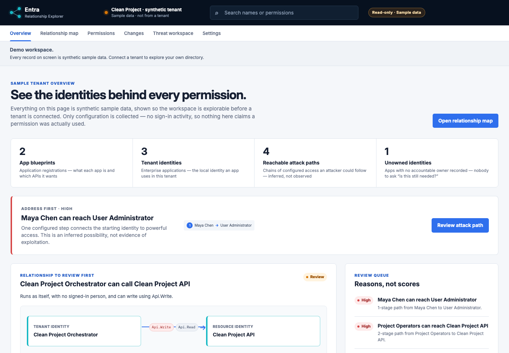
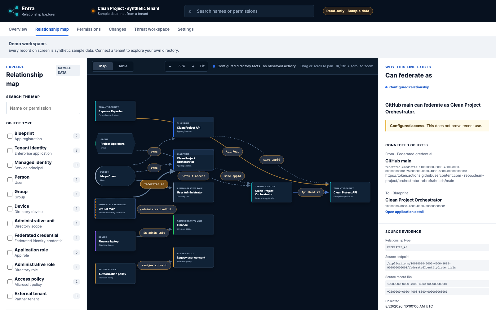
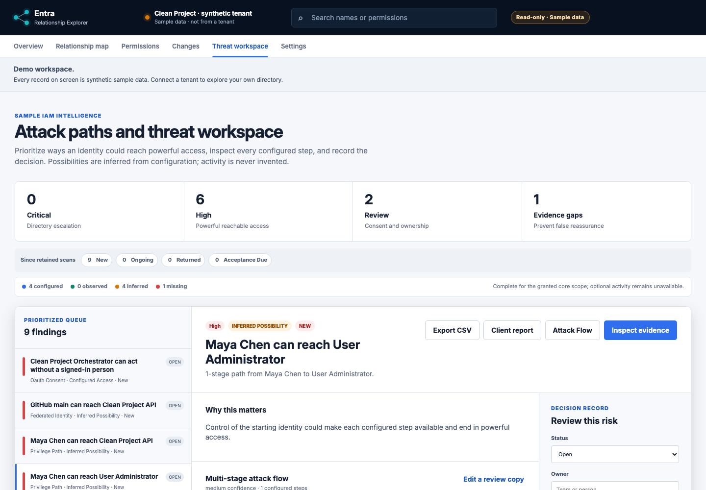

# Entra Relationship Explorer

[](https://github.com/loredan1994/entra-relationship-explorer/actions/workflows/ci.yml)
[](LICENSE)

Understand who can reach what in a Microsoft Entra tenant, and why.

Entra Relationship Explorer is a local-first, read-only IAM investigation workspace. It collects a tenant snapshot through Microsoft Graph, preserves the evidence behind each relationship, explains reachable privilege paths, and gives reviewers a place to record decisions without changing Microsoft Entra.



The screenshots use the repository's synthetic **Clean Project** fixture. They show the real application in sample-data mode; no customer or live tenant data is included.

| Relationship map and evidence | Threat workspace |
|---|---|
|  |  |

## Try it without a tenant

```bash
pnpm install --frozen-lockfile
pnpm dev
```

Open `http://localhost:3000/overview`. This runs against a synthetic sample tenant — no Microsoft account, no Graph calls, nothing to configure. [Connect your own tenant](#connect-your-own-tenant) when you want real data.

## What it does and does not do

**It does:** read one tenant you administer over Microsoft Graph, encrypt live snapshots and review decisions in your own PostgreSQL, draw evidence-backed relationships as a searchable map and table, compare findings across retained scans, find bounded privilege paths, map relevant scenarios to MITRE ATT&CK®, and export sanitized findings, reports, relationships, and MITRE Attack Flow.

**It does not:** grant permissions, remove assignments, create secrets, remediate findings, schedule unattended scans, send notifications, or provide hosted multi-tenancy. The Graph transport is GET-only, and that is enforced in code, not by convention. Microsoft Graph is the only external API used for tenant evidence, and stored tenant data remains in the PostgreSQL instance you run.

By default it requests two delegated permissions, `Application.Read.All` and `Directory.Read.All`. Four further read-only scopes are available, each consented separately and only if you want what they add. Write-capable scopes are rejected outright. [SECURITY.md](SECURITY.md) documents the full model.

## The simple version

- An **app registration** is the blueprint: what an application is, what roles it offers, and which APIs it wants to call.
- An **enterprise application** is that application's local identity inside a tenant. Microsoft Graph calls it a **service principal**.
- A **client service principal** receives permission to call a **resource service principal**.
- This tool draws those facts as a searchable map and shows the evidence behind every line.

The product is deliberately read-only. It does not grant permissions, remove assignments, create secrets, or change Entra.

## Start here

- [Product specification](docs/PRODUCT_SPEC.md)
- [Architecture and Graph model](docs/ARCHITECTURE.md)
- [Security and privacy](docs/SECURITY_PRIVACY.md)
- [Implementation plan](docs/IMPLEMENTATION_PLAN.md)
- [Phase 1 read-only tenant scan](docs/PHASE_1_READ_ONLY.md)
- [Phase 2 investigation quality](docs/PHASE_2_INVESTIGATION.md)
- [Local container operations](docs/LOCAL_OPERATIONS.md)
- [Version 1 API contract](docs/openapi.yaml)
- [Research notes and primary references](docs/RESEARCH_NOTES.md)
- [Design system](DESIGN.md)
- [Third-party notices](THIRD_PARTY_NOTICES.md)

## Diagrams

| Diagram | PNG | Editable source |
|---|---|---|
| Evidence and relationship model | [PNG](diagrams/entra-object-model.png) | [Mermaid](diagrams/entra-object-model.mmd) |
| Current local architecture | [PNG](diagrams/system-architecture.png) | [Mermaid](diagrams/system-architecture.mmd) |
| Resumable GET-only scan flow | [PNG](diagrams/scan-flow.png) | [Mermaid](diagrams/scan-flow.mmd) |

## Current status

The product includes fixture-driven exploration, single-tenant Microsoft sign-in, GET-only paginated Graph reads, PostgreSQL-backed encrypted sessions, checkpoints, snapshots, and finding decisions, a durable resumable scan queue, throttling-aware progress and cancellation, snapshot and finding-lifecycle comparison, explicit per-scan decision revalidation, bounded graph analysis, attack-path discovery, editable review copies of IAM attack flows, and CSV, standalone HTML, relationship, and MITRE Attack Flow exports. The default local registration requests only `Application.Read.All` and `Directory.Read.All`; optional evidence is explicitly gated.

The core scan also resolves devices, administrative units and scoped roles, plus application and managed-identity federated workload trust. Optional scopes are configured through `ENTRA_OPTIONAL_GRAPH_SCOPES`: `RoleManagement.Read.Directory` adds active and PIM-eligible administrative roles, `Policy.Read.All` adds Conditional Access, authorization, and partner cross-tenant settings, `Policy.Read.PermissionGrant` adds consent-policy conditions, and `AuditLog.Read.All` adds a 30-day observed sign-in overlay. Unknown and write-capable scopes are rejected. All Graph transport remains GET-only.

## Connect your own tenant

Only needed when you want to scan real data. Never point the product at a tenant you do not administer.

1. In the Microsoft Entra admin center, create a **single-tenant** app registration.
2. Add a **Web** redirect URI of `http://127.0.0.1:3000/api/auth/callback`, plus `http://127.0.0.1:3200/api/auth/callback` for the container stack.
3. Add the **delegated** Microsoft Graph permissions `Application.Read.All` and `Directory.Read.All`, then grant administrator consent. Add nothing else.
4. Create a client secret and keep it outside the repository.
5. Copy `apps/web/.env.example` to `.env.local` at the repository root and fill in your tenant ID, client ID, client secret, and a data-encryption key from `openssl rand -base64 32`. `.env.local` is git-ignored.
6. Start Docker Desktop and run `pnpm dev:live`, then open `http://127.0.0.1:3200/settings`.

Full steps are in [CONTRIBUTING.md](CONTRIBUTING.md), and the runbook is in [docs/LOCAL_OPERATIONS.md](docs/LOCAL_OPERATIONS.md).

## Development

Quality gates beyond `pnpm run verify`: `pnpm quality:crap` runs unit coverage and writes a CRAP (Change Risk Anti-Patterns) report to `quality-reports/crap-report.md`, ranking every function by complexity² × (1 − coverage)³ + complexity; `pnpm test:mutation` runs StrykerJS mutation testing per package and writes HTML reports to each package's `reports/mutation/`. Every package currently holds 100% statement, branch, and function coverage, no function is above the CRAP threshold, and the mutation run enforces a 95% minimum score. Mutants that no input can distinguish are marked in the source with a `Stryker disable` comment stating why.

Open `http://localhost:3000/overview`. The `/security` section prioritizes transitive identity paths, distinguishes configured facts from observed activity, inferred possibilities, and missing evidence, maps relevant scenarios to MITRE ATT&CK®, and provides a synchronized review workspace. Run `pnpm run verify`; it validates Compose isolation, lints and type-checks the workspace, runs domain, scanner, storage, authentication, accessibility, and browser tests, and builds every product route.

The product remains in fixture mode by default, so you can explore it without a tenant. To scan a real tenant you need your own app registration; see [Connect your own tenant](#connect-your-own-tenant). With that in place, start Docker Desktop and run `pnpm dev:live`. It loads the app credential, encryption key, and database password from your Key Vault or a git-ignored `.env.local`, builds the containers, applies idempotent migrations, and starts PostgreSQL, web, and worker services on loopback interfaces. No secret is written into the repository.

## Contributing

Contributions are welcome. [CONTRIBUTING.md](CONTRIBUTING.md) covers setup, the quality gates, and the seven rules a change has to respect — the first being that the product never writes to Entra. Please read the [Code of Conduct](CODE_OF_CONDUCT.md) before participating.

Found a security defect? **Do not open a public issue.** Follow [SECURITY.md](SECURITY.md).

## License

[Apache License 2.0](LICENSE). Copyright 2026 Nicolae-Loredan Calimanu. Third-party components are inventoried in [oss-inventory.json](oss-inventory.json) with notices in [THIRD_PARTY_NOTICES.md](THIRD_PARTY_NOTICES.md).

## Trademarks

MITRE ATT&CK® is a registered trademark of The MITRE Corporation. Use of ATT&CK identifiers here does not imply MITRE's endorsement of, or affiliation with, this product; see the [ATT&CK terms of use](https://attack.mitre.org/resources/terms-of-use/). Microsoft, Microsoft Entra, Microsoft Graph, and Azure are trademarks of the Microsoft group of companies. This project is not affiliated with, endorsed by, or sponsored by Microsoft.
