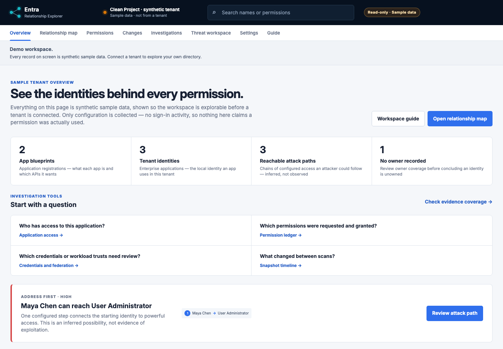
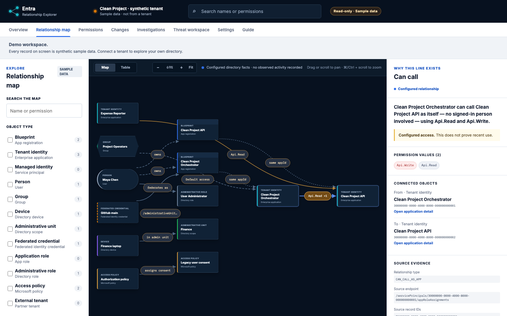
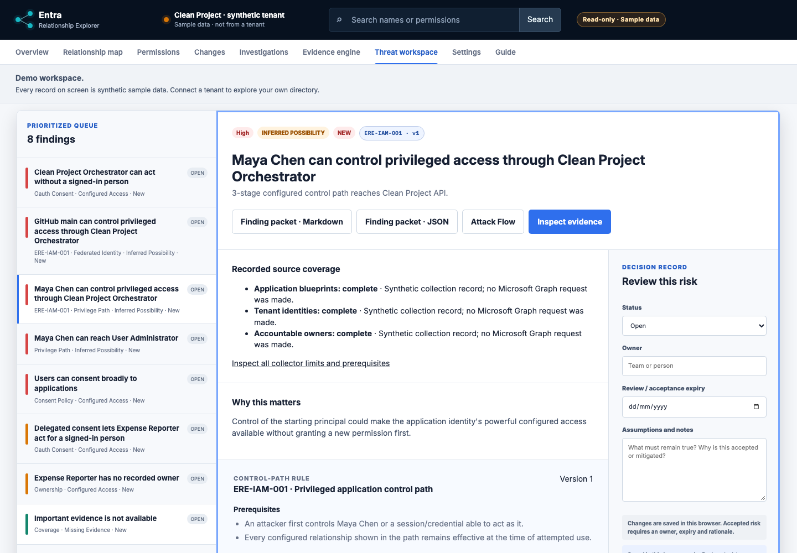

# Entra Relationship Explorer

[](https://github.com/loredan1994/entra-relationship-explorer/actions/workflows/ci.yml)
[](LICENSE)

**Understand access. Follow the evidence. Keep Entra read-only.**

A local investigation workspace for Microsoft Entra administrators, security reviewers and application owners. Collect a snapshot of one tenant, explore application relationships, explain configured permissions, compare changes and record review decisions. Every relationship links back to object IDs and a Microsoft Graph source endpoint.

The collector never grants permissions, removes assignments, rotates credentials or applies remediation. Review decisions stay in your own workspace. What-if plans operate on a copy in browser memory.



All previews use the bundled **Clean Project** sample. No live tenant or customer data is included.

## Try it in two minutes

Requirements: Node.js 24 (recommended) and pnpm 11.23.0. Development also supports Node.js 22.12+ on the 22.x line or 26+. CI and the container runtime use Node.js 24. Docker is needed only for the live stack or database integration tests.

```bash
pnpm install --frozen-lockfile
pnpm dev
```

Open [the overview](http://localhost:3000/overview), then **Guide** for a short walkthrough. The default workspace uses synthetic records: no Microsoft account, Graph calls or tenant configuration. Follow a connection in **Relationship map**, or select a question from the overview.

## Choose an investigation

| Your question | Where to go | What you get |
|---|---|---|
| What did the scan actually collect? | Investigations → Evidence coverage | Per-collector status, scope, limits, successful and failed reads |
| How are these identities connected? | Relationship map | Searchable graph and equivalent table, with exact source evidence |
| Who has access to this application? | Investigations → Application access | Sign-in controls, owners, direct assignments, consent and separate observed activity |
| Which permissions were requested and granted? | Investigations → Permission ledger | Manifest requests reconciled with configured grants and consent audiences |
| Which credentials or trusts need review? | Investigations → Credentials and federation | Validity metadata, rotation overlap and federated workload trust; never secret values |
| What changed between scans? | Changes | Selectable retained snapshots, field differences and credential history |
| What if a relationship were removed? | Investigations → What-if planner | Local path comparison and tenant/snapshot-bound review-plan import/export |
| Which possible paths should we investigate? | Threat workspace | Bounded control paths, findings, lifecycle and saved review decisions |
| Can I prove, test and plan configured access? | Evidence engine | Ten local workflows: proofs, access compilation, temporal paths, change planning, policy counterexamples, federation, rotation, evidence gaps, contracts and offline replay |
| How can I contribute a tested rule? | Investigations → Rule laboratory | Synthetic declarative cases with positive and negative expectations |

The [user guide](docs/USER_GUIDE.md) explains a complete investigation. The [investigation reference](docs/INVESTIGATIONS.md) documents collection bounds, optional audit context and edge cases.

| Relationship map and evidence | Threat workspace |
|---|---|
|  |  |

## Read the evidence correctly

- **Configured:** a recorded grant or setting, not proof of use or effective access in every context.
- **Observed:** an event within a collection window, not proof that a particular permission was exercised.
- **Inferred:** a possible path under stated assumptions, not evidence of exploitation.
- **Missing:** unavailable, disabled, partial or uncollected evidence, not proof of absence or safety.

An **app registration** is the application's blueprint. An **enterprise application (service principal)** is its local tenant identity. The tool connects those records with owners, callers, resources, grants and source evidence. Display names alone are never used to establish identity.

This is a local, single-tenant tool. It does not provide unattended scan schedules, notifications, hosted multi-tenancy or automated remediation. User sign-in evidence does not establish complete workload activity. Group membership, policy interpretation and path traversal have explicit limits. Check **Evidence coverage** before concluding that access is absent. [Security and privacy](docs/SECURITY_PRIVACY.md) describes the boundary.

## Connect your own tenant

Use a tenant you administer. The default collector requests only the delegated `Application.Read.All` and `Directory.Read.All` Microsoft Graph permissions. Graph transport is GET-only; write-capable scopes are rejected.

1. Create a **single-tenant** app registration in Microsoft Entra admin center.
2. Add **Web** redirect URIs `http://127.0.0.1:3000/api/auth/callback` and `http://127.0.0.1:3200/api/auth/callback` for local and container use.
3. Add the two delegated read permissions above and grant administrator consent.
4. Create an app credential and keep it outside Git. Copy `apps/web/.env.example` to a git-ignored `.env.local` at the repository root and supply the tenant ID, client ID, client secret and a data-encryption key generated with `openssl rand -base64 32`.
5. Start Docker Desktop, run `pnpm dev:live`, then open [Settings](http://127.0.0.1:3200/settings). Sign in and start the first scan.
6. Open **Evidence coverage**, then investigate the recorded snapshot. Earlier snapshots remain available for 30 days.

The launcher supports Azure Key Vault as an alternative secret source; see [local operations](docs/LOCAL_OPERATIONS.md). It starts web, worker and PostgreSQL services on loopback interfaces and applies migrations. Live snapshots, sessions and review decisions are encrypted in your own database. Exports are explicit downloads and may still contain sensitive tenant identifiers; sanitized does not mean anonymous.

Optional evidence is deliberately separate:

| Optional read scope / setting | Adds |
|---|---|
| `RoleManagement.Read.Directory` | Active and PIM-eligible administrative roles |
| `Policy.Read.All` | Conditional Access, authorization and partner cross-tenant settings |
| `Policy.Read.PermissionGrant` | Consent-policy conditions |
| `AuditLog.Read.All` | A bounded 30-day user sign-in overlay |
| `ENTRA_COLLECT_DIRECTORY_AUDITS=true` | Bounded directory-audit context using the existing `Directory.Read.All` scope |

Set optional scopes through `ENTRA_OPTIONAL_GRAPH_SCOPES`; consent only what you need. Operator role, licensing, retention and endpoint failures can still limit evidence. Audit correlation does not establish who caused a change. [Configuration and limits](docs/INVESTIGATIONS.md).

## Develop and verify

```bash
pnpm verify                 # lint, types, tests, build and browser checks
pnpm security:dependencies  # current runtime and development advisories
pnpm quality:crap           # coverage and maintainability gate
pnpm test:mutation --force --concurrency 2
```

Run coverage and mutation checks sequentially. Mutation testing enforces a 95% floor per package; maintainability fails above CRAP 30. The [custom engine validation report](docs/CUSTOM_ENGINE_VALIDATION_2026-10-09.md) records the current tests, mutation scores, read-only Azure CLI comparisons and their limits. The [earlier release report](docs/RELEASE_VERIFICATION_2026-10-08.md) covers the investigation workspace.

For database and browser persistence tests, set `TEST_DATABASE_URL` to an isolated loopback PostgreSQL database named `entra_review_test`. Without it, those tests explicitly skip. CI provisions this service and runs the full suite; [reproduction instructions](docs/INVESTIGATIONS.md#verification). No real tenant is needed for deterministic tests.

## Documentation and contribution

| Need | Read |
|---|---|
| First investigation | [User guide](docs/USER_GUIDE.md) · in-app **Guide** |
| Feature details and limitations | [Investigation tools](docs/INVESTIGATIONS.md) · [Product specification](docs/PRODUCT_SPEC.md) |
| Install, operate or upgrade | [Local operations](docs/LOCAL_OPERATIONS.md) · [Changelog](CHANGELOG.md) |
| Data and authentication boundaries | [Security and privacy](docs/SECURITY_PRIVACY.md) · [Security reporting](SECURITY.md) |
| Architecture and integration | [Architecture](docs/ARCHITECTURE.md) · [OpenAPI](docs/openapi.yaml) · [Research sources](docs/RESEARCH_NOTES.md) |
| Custom engine | [Ten implemented workflows, support matrix and CLI](docs/CUSTOM_ENGINE.md) · [roadmap and market comparison](docs/CUSTOM_ENGINE_ROADMAP.md) |
| Submit a change | [Contributing](CONTRIBUTING.md) · [Code of conduct](CODE_OF_CONDUCT.md) · [Design system](DESIGN.md) |
| Add an investigation rule | [Rule laboratory](docs/RULE_LAB.md) · [Rule catalog](docs/RULE_CATALOG.md) · [Fixture template](docs/RULE_TEMPLATE.md) |

Diagrams: [relationship model](diagrams/entra-object-model.png), [local architecture](diagrams/system-architecture.png), [scan flow](diagrams/scan-flow.png). Editable Mermaid sources are beside each image.

Contributions require behavioral tests, source evidence, tenant isolation and a signed-off commit. Never commit credentials or real tenant data. Report security defects through [SECURITY.md](SECURITY.md), not a public issue.

The [dependency follow-up verification](docs/DEPENDENCY_FOLLOWUP_2026-10-08.md) records the SDK/toolchain migrations, real authentication checks and resolutions from the PR review.

## License

[Apache License 2.0](LICENSE). Copyright 2026 Nicolae-Loredan Calimanu. Third-party components are inventoried in [oss-inventory.json](oss-inventory.json) with notices in [THIRD_PARTY_NOTICES.md](THIRD_PARTY_NOTICES.md).

## Trademarks

MITRE ATT&CK® is a registered trademark of The MITRE Corporation. Use of ATT&CK identifiers here does not imply MITRE's endorsement of, or affiliation with, this product; see the [ATT&CK terms of use](https://attack.mitre.org/resources/terms-of-use/). Microsoft, Microsoft Entra, Microsoft Graph, and Azure are trademarks of the Microsoft group of companies. This project is not affiliated with, endorsed by, or sponsored by Microsoft.
