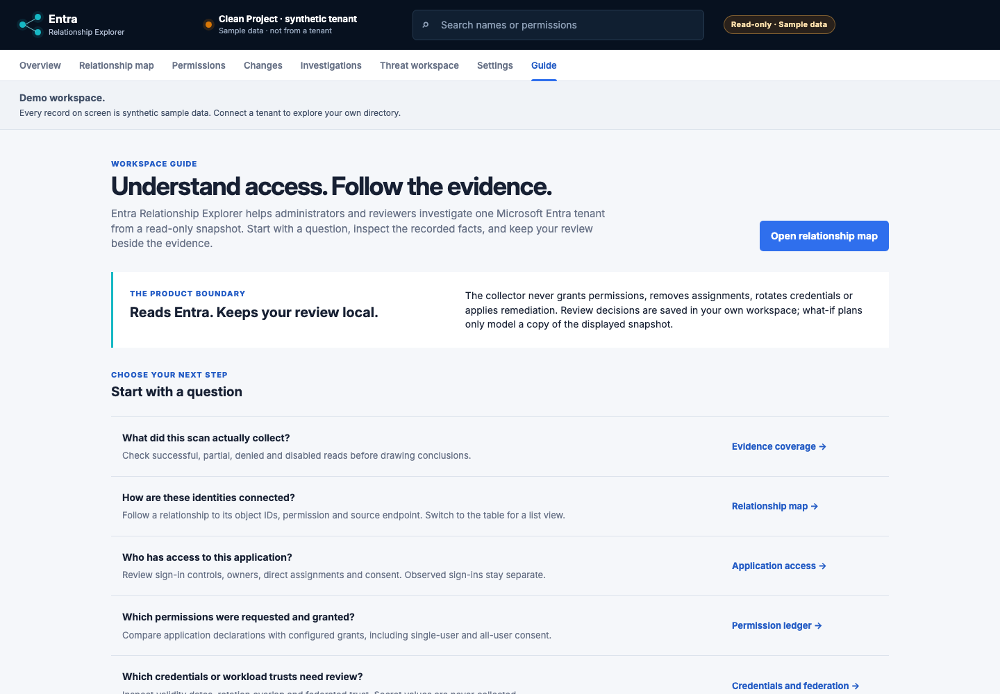

# User guide

Entra Relationship Explorer is a local, read-only investigation workspace for a single Microsoft Entra tenant. It helps explain recorded access and possible control paths. It does not change Entra or establish that access was exercised. The in-app **Guide** and overview shortcuts lead to the same workflows described here.

## Start with the sample

Follow the [README quick start](../README.md#try-it-in-two-minutes), open **Overview**, then **Relationship map**. All demo records are synthetic. Select a connection to see its IDs, permission, source endpoint and evidence classification. The table provides the same relationship inventory without requiring graph navigation.

An app registration is the blueprint; an enterprise application (service principal) is its tenant identity. A caller receives configured access to a resource. Names are labels; object and application IDs establish identity.

## Your first tenant investigation

1. **Connect and scan.** Follow [tenant setup](../README.md#connect-your-own-tenant). Review the configured scopes in Settings and start a read-only scan. The source banner distinguishes sample data from a tenant snapshot, including when you are signed out or no scan has completed.
2. **Check the evidence.** Open Investigations → Evidence coverage. Inspect collection time, successful reads, failures and bounds. Complete collection for one source does not make every optional dataset complete.
3. **Choose an application.** Open Application access and search by name or ID. Inspect sign-in audience, account and assignment controls, publisher context, owners, direct assignments and consent. Unknown historical metadata needs a fresh scan. Publisher verification is not a safety rating.
4. **Follow a relationship.** Open its map evidence. Check the source and target IDs, relationship type, source records and endpoint. Direct assignments do not expand into all effective group members.
5. **Reconcile permissions.** Use Permission ledger to distinguish requested-and-granted, requested-not-granted, granted-not-requested and unknown. Dynamic consent can legitimately differ from an application manifest; a difference is not an automatic removal recommendation.
6. **Record your reasoning.** In Threat workspace, inspect a finding’s evidence and assumptions before saving an owner, decision and rationale. A competing edit or newer snapshot requires a reload and review. Prior decisions must be explicitly revalidated.

## Investigate a change or credential

**Changes** compares a selected earlier/later pair of retained snapshots. Review field values and source coverage before treating a disappearance as confirmed. Newly collected fields in an older schema are not established configuration changes. Credential and trust history includes validity changes, additions and removals.

**Credentials and federation** shows individual password/certificate identifiers and validity dates alongside federated trust. Dates are evaluated at scan time. “Valid” describes an interval, not deployment or use; a credential crossing its expiry date is not itself a configuration edit. No secret value or certificate material is displayed or retained in snapshots.

Optional directory-audit events can be correlated with changed object IDs and the comparison interval. They are candidate context, not proof of causality. Denied or unavailable audit evidence leaves the actor unknown.

## Model a review plan

The **What-if planner** excludes selected configured relationships from an in-memory copy and compares bounded paths. It does not revoke access, predict business impact or account for credentials/sessions already possessed. Alternative paths and incomplete coverage remain visible.

An explicitly exported review plan can be imported only for the same tenant, snapshot ID and scan time. Results are recomputed locally. Imports are limited to 100 KB and 100 exclusions; invalid or stale plans leave the current scenario intact. Refreshing the page discards unsaved in-memory choices.

## Understand evidence labels

| Label | What it means | What it does not prove |
|---|---|---|
| Configured | A recorded setting, grant or relationship | Recent use or effective access in every context |
| Observed | An event recorded within a collection window | Exercise of a particular permission |
| Inferred | A possible path under the rule’s assumptions | Exploitation or compromise |
| Missing | Evidence is incomplete, disabled, denied or unavailable | Absence, safety or a disabled account |

The activity collector covers user sign-ins, not complete service-principal/workload activity. Group membership has Graph v1.0 limitations. Conditional Access references do not evaluate effective enforcement. Path searches have depth, path and traversal bounds. See the [investigation reference](INVESTIGATIONS.md) for exact limits.

## Keep review data under control

- Live snapshots, sessions and review decisions are encrypted in your own PostgreSQL. Evidence and linked decisions expire after 30 days; physical cleanup runs in the worker.
- Demo review decisions and saved filters use browser storage. What-if calculations use browser memory; plan imports are not uploaded.
- Explicit exports can contain names, IDs and sensitive relationships. Sanitization removes unsupported/raw fields, not all identifying information. Review recipients and handling before sharing.
- No hosted multi-tenancy, notification delivery, unattended scan schedule or remediation is provided.

For rule contributions, use the **Rule laboratory** with synthetic declarative cases and follow [RULE_LAB.md](RULE_LAB.md). For deployment and upgrade procedures, use [LOCAL_OPERATIONS.md](LOCAL_OPERATIONS.md) and [CHANGELOG.md](../CHANGELOG.md).
